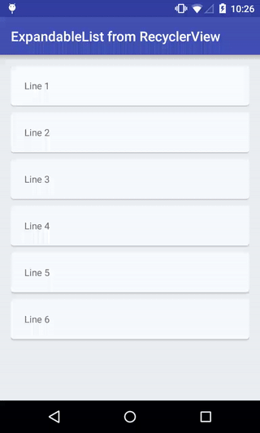

Expandable list build with a simple RecyclerView

When you want to expand a section you just add new items to your adapter after the item to expand. 
Call `notifyItemRangeInserted()` when you do this. 
To collapse a section you simply remove the relevant items, and call `notifyItemRangeRemoved()`.

It's as simple as that, you do not need a extern library

